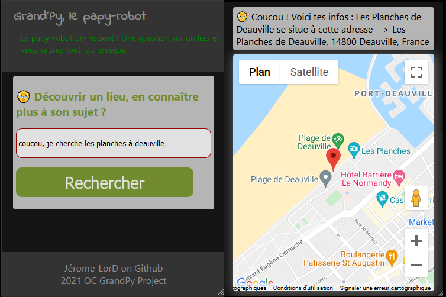

# 👴 GrandPy, le papy-robot

## About The Project
7th project of the OC work plan of the python developer course.

A form of chat-bot that is the embodiment of an old man in as an omniscient robot. Answering questions about a place and locating it on a map is its main functionality.

### Built With
* [Flask](https://flask.palletsprojects.com/en/2.0.x/)

## Installation

This project works with the `Flask` framework.

1. Clone the repo
   ```sh
   git clone https://github.com/Jerome-LorD/P7_GrandPy.git
   ```
2. Get a your own API Key at [https://console.cloud.google.com](https://console.cloud.google.com)

3. Create a virtual environment
   ```sh
   py - m venv your_env
   ```
4. Install the requirements.txt
   ```sh
   pip install -r requirements.txt
   ```
5. Create a `.env` file at the root of the project. Enter your API Keys in it
   ```py
   FLASK_ENV=development (or production)
   SECRET_KEY=your key
   JS_API_KEY=your key
   PLACES_API_KEY=your key
   ```
6. To run the tests (-v = verbose mode)
   ```sh
   pytest -v
   ```

### Usage
Do not forget to stay in development mode
`$env:FLASK_ENV = "development"`
and then `py -m run`
finally you can see the app on your [localhost](http://127.0.0.1:5000) 👴

 